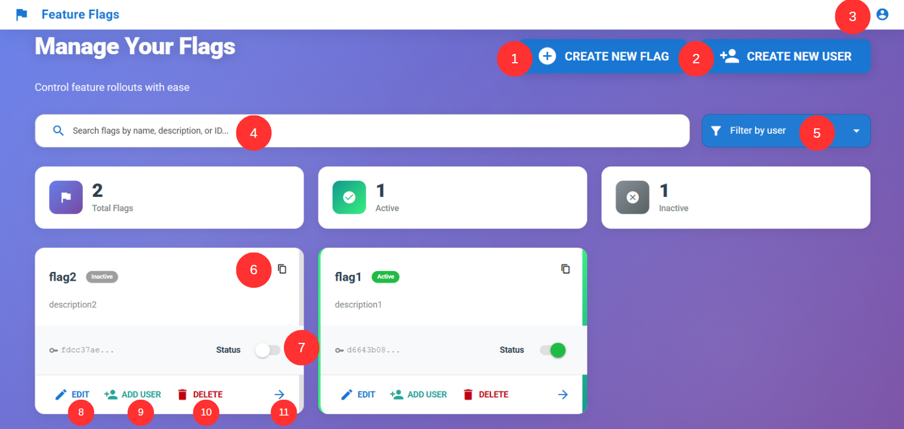
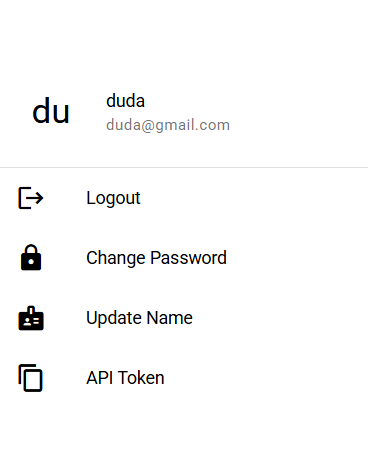

# Feature Flag Manager

O Feature Flag Manager é uma plataforma completa para criação, gerenciamento e controle de feature flags.
Além de administrar flags, o sistema permite cadastrar usuários, associá-los a flags específicas e controlar individualmente se cada usuário tem acesso ou não à funcionalidade.

Ele também inclui ferramentas de busca e filtragem, permitindo encontrar feature flags por:
- Nome
- ID
- Descrição
- Usuário associado

<br>

## Instalação

### 1. Clone o repositório
```bash
git clone https://github.com/daviporto/feature-flags.git
cd feature-flags
```

### 2. Suba o backend
```bash
cd back
docker compose up -d
npm install
npm run start
```
Isso irá:
- subir o banco de dados via Docker
- instalar dependências
- iniciar o servidor Fastify

### 3. Rode o frontend
```bash
cd front
npm install
npm run dev
```
A aplicação ficará disponível normalmente em:
```bash
http://localhost:9000/
```

<br>

## Como utilizar

- Abra a interface no navegador, você verá uma página parecida com a seguir

- A seguir são listadas o que cada funcionalidade permite fazer
### 1. Cria uma nova feature flag
Abre um modal onde você pode criar uma flag informando:
- Nome (obrigatório)
- Descrição (opcional)
- Status inicial (ativada ou desativada)

### 2. Criar um novo usuário
Permite cadastrar um usuário fornecendo:
- Nome (obrigatório)
- Email (obrigatório)
- External UUID (obrigatório)
Após criado, esse usuário pode ser associado a qualquer feature flag.

### 3. Menu do usuário logado
Abre um painel contendo:
- Nome e email do usuário
- Opções para editar nome ou senha
- Botão para logout
- Botão para copiar o API Token utilizado para autenticação na API

### 4. Barra de pesquisa
Filtra feature flags por:
- Nome
- Descrição
- ID da flag
A pesquisa é atualizada em tempo real conforme o usuário digita.

### 5. Filtragem por usuário
Exibe apenas as features flags em que o usuário selecionado está adicionado. Permite localizar rapidamente quais funcionalidades estão habilitadas para cada usuário.

### 6. Copiar ID da flag
Copia para a área de transferência o ID único da feature flag.

### 7. Ativar ou desativar uma feature flag
Alterna o status da flag entre:
- Active (ativa)
- Inactive (desativada)

### 8. Editar a feature flag
Abre um modal que permite modificar:
- Nome
- Descrição
da feature flag.

### 9. Gerenciamento de usuários dentro da flag
Permite:
- Adicionar um usuário à flag
- Ativar ou desativar o acesso desse usuário à flag
- Remover o usuário da flag

### 10. Deletar a flag
Remove permanentemente a feature flag do sistema

### 11. Ver detalhes da feature flag
Exibe informações completas sobre a flag, sendo elas:
- Nome
- Descrição
- Status (ativa ou desativada)
- Data de criação
- Data da última modificação
- ID da flag


## API Token
Para consumir a API de features flags via cliente externo, como o frontend, é necessário enviar o API Token do usuário via header.
Esse token pode ser copiado no painel do usuário (ícone de perfil no canto superior direito):


<br>

## Rotas da API

### Autenticação
| Método | Rota              | Descrição                           |
|--------|-------------------|---------------------------------------|
| POST   | `/user/login`     | Realiza login e retorna o API Token.  |
| POST   | `/user/verifyToken` | Verifica se o token enviado é válido. |

### Usuários
| Método | Rota              | Descrição                           |
|--------|-------------------|---------------------------------------|
| POST   | `/user`     | Cria um novo usuário.  |
| GET   | `/user/{id}`     | Busca um usuário pelo ID.  |
| PUT   | `/user/{id}`     | Atualiza dados do usuário.  |
| DELETE   | `/user/{id}`     | Remove um usuário.  |
| PATCH   | `/user/{id}/password`     | Atualiza a senha do usuário.  |


### Feature Flags
| Método | Rota              | Descrição                           |
|--------|-------------------|---------------------------------------|
| POST   | `/user`     | Cria uma nova feature flag.  |
| GET   | `/feature-flag?filters` | Busca feature flag por filters (ID, nome, descrição). |
| GET   | `/feature-flag/{id}` | Busca uma feature flag específica. |
| PUT   | `/feature-flag/{id}` | Atualiza nome e/ou descrição da flag. |
| DELETE   | `/feature-flag/{id}` | Remove uma feature flag. |


### App Users
| Método | Rota              | Descrição                           |
|--------|-------------------|---------------------------------------|
| POST   | `/app-user`     | Cria um novo App User.  |
| GET   | `/feature-flag?filters` | Busca user por filters. |
| GET   | `/app-user/{id}` | Retorna um App User pelo ID. |
| PUT   | `/app-user/{id}` | Atualiza nome, email e/ou external ID. |
| DELETE   | `/app-user/{id}` | Remove um App User. |


### User Feature Flags
Gerencia relação usuário e feature flag.
| Método | Rota              | Descrição                           |
|--------|-------------------|---------------------------------------|
| POST   | `/user-feature-flags`     | Adiciona um usuário a uma feature flag.  |
| GET   | `/user-feature-flags?filters` | Busca users de uma feature flags por filters. |
| GET   | `/user-feature-flags/{id}` | Retorna detalhes da relação usuário-flag. |
| PUT   | `/user-feature-flags/{id}` | Atualiza se usuário está ativo na flag. |
| DELETE   | `/user-feature-flags/{id}` | Remove um usuário da feature flag. |


### Como fazer uma requisição autenticada
Todas as requisições à API da feature flag devem incluir o header:
```bash
x-api-token: SEU_TOKEN_AQUI
```

<br>

## Utilizando a API Client
O endpoint principal para buscar feature flags é:
```http
GET /feature-flag/client
```

O header obrigatório é:
```http
X-API-Token: <token>
```

### Exemplos de consumo
#### Exemplo usando Axios (TypeScript)
```ts
const response = await getAxiosFeatureFlagClient().get<FeatureFlagResponse>(
    `feature-flag/client?${params.toString()}`,
    {
        headers: {
            "x-api-token": token,
        },
    }
);
```

#### Exemplo usando cURL
```bash
curl --request GET \
  --url http://localhost:9000/feature-flag/client \
  --header "X-API-Token: d4f310cc-3c30-48ba-9a0c-46fb1659e659"
```

### Exemplos de Resposta
Ao pesquisar por uma feature flag, é possível serem retornadas mais de uma resposta, sendo elas:

#### 1. Flag com usuário associado
```json
{
	"data": {
		"id": "71d7b92f-98c2-4252-b654-cf5453362b3e",
		"name": "Alterar Nome",
		"description": "Dar permissão para o usuário mudar o nome na aplicação",
		"enabled": true,
		"createdAt": "2025-11-13T07:58:31.950Z",
		"updatedAt": "2025-11-13T07:58:31.952Z",
		"targetUser": {
			"id": "37116705-5cd7-44bb-b421-db40857ce8ad",
			"featureFlagId": "71d7b92f-98c2-4252-b654-cf5453362b3e",
			"userId": "dd9f7c87-c631-4f9c-ac8a-cccccc8310aa",
			"enabled": true
		}
	}
}
```

#### 2. Flag retornada sem usuários associados
```json
{
	"data": {
		"id": "71d7b92f-98c2-4252-b654-cf5453362b3e",
		"name": "Alterar Nome",
		"description": "Dar permissão para o usuário mudar o nome na aplicação",
		"enabled": true,
		"createdAt": "2025-11-13T07:58:31.950Z",
		"updatedAt": "2025-11-13T07:58:31.952Z"
	}
}
```

#### 3. Flag não encontrada
```json
{
	"statusCode": 404,
	"error": "Not Found",
	"message": "Feature flag having name Invalid Name not found"
}
```

